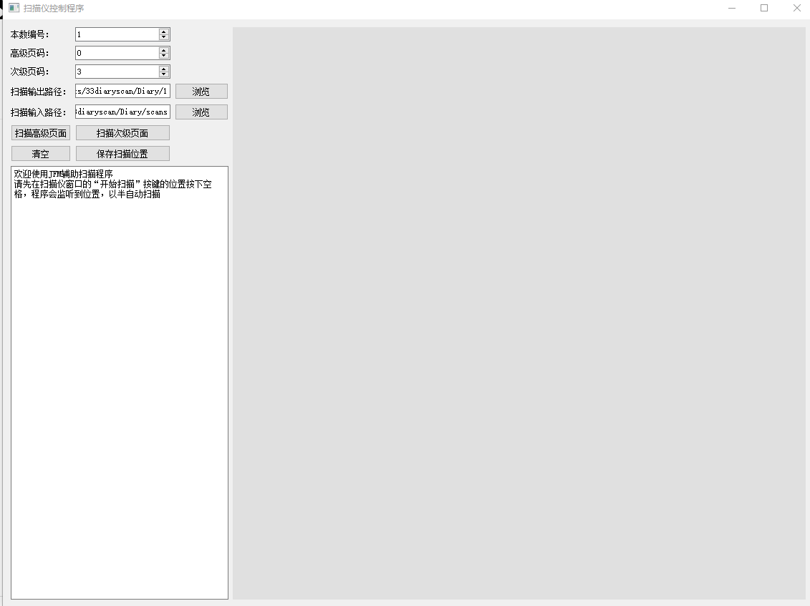
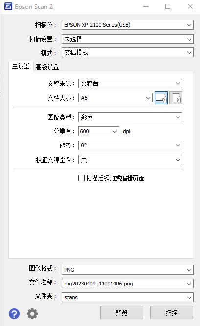

# JFMscanhelper
基于python的半自动扫描仪辅助程序

可以辅助家庭打印机的扫描软件，进行整本扫描。

次级页码属于高级页码，用于夹页等用途，也可以不理会。

本数编号是整个扫描工作的前缀

做这个程序的目的是为了扫描自己的日记，但是家庭打印机扫描起来确实不方便，希望可以有人用到它吧。

扫描仪驱动程序看起来是这样。

需要在打开辅助程序后，把鼠标放在“扫描按键”上，按一下空格，辅助程序可以监听到空格和鼠标位置。

扫描结束后会显示图片并且由用户选择四个点进行四边形拉伸变换。然后用户自己翻页，点击“扫描x级页面”。
